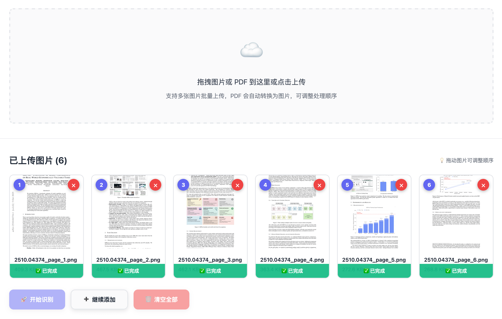

# 🔍 DeepSeek-OCR-WebUI

<div align="center">

**🌐 [English](./README.md) | [简体中文](./README_zh-CN.md) | [繁體中文](./README_zh-TW.md) | [日本語](./README_ja.md)**

[](./CHANGELOG.md)
[](./docker-compose.yml)
[](./LICENSE)
[](#多語言支援)

智能OCR識別系統 · 批量處理 · 多模式支援 · 邊界框可視化

[功能特性](#功能特性) • [快速開始](#快速開始) • [版本歷史](#版本歷史) • [文檔](#文檔) • [貢獻](#貢獻)

</div>

---

## 📖 簡介

DeepSeek-OCR-WebUI 是一個基於 DeepSeek-OCR 模型的智能圖像識別 Web 應用，提供直觀的用戶介面和強大的識別功能。

### 🖼️ UI 預覽

<div align="center">


**現代化的用戶介面，支援多語言切換、批量處理、邊界框可視化**

</div>

### 📈 Star 增長曲線

<div align="center">


**Star 增長曲線 - 幫助我們成長！⭐**

</div>

### ✨ 核心亮點

- 🎯 **7 種識別模式** - 文檔、OCR、圖表、Find、Freeform 等
- 🖼️ **邊界框可視化** - Find 模式自動標註位置
- 📦 **批量處理** - 支援多張圖片逐一識別
- 📄 **PDF 支援** - 上傳 PDF 文件，自動轉換為圖片
- 🎨 **現代化 UI** - 炫酷的漸變背景和動畫效果
- 🌐 **多語言支援** - 簡中、繁中、英語、日語
- 🐳 **Docker 部署** - 一鍵啟動，開箱即用
- ⚡ **GPU 加速** - 基於 NVIDIA GPU 的高性能推理
- 🌏 **ModelScope 自動切換** - HuggingFace 不可用時自動切換到 ModelScope

---

## 🚀 功能特性

### 7 種識別模式

| 模式 | 圖標 | 說明 | 適用場景 |
|------|------|------|---------|
| **文檔轉Markdown** | 📄 | 保留格式和佈局 | 合同、論文、報告 |
| **通用OCR** | 📝 | 提取所有可見文字 | 圖片文字提取 |
| **純文本提取** | 📋 | 純文本不保留格式 | 簡單文本識別 |
| **圖表解析** | 📊 | 識別圖表和公式 | 數據圖表、數學公式 |
| **圖像描述** | 🖼️ | 生成詳細描述 | 圖片理解、無障礙 |
| **查找定位** ⭐ | 🔍 | 查找並標註位置 | 發票字段定位 |
| **自定義提示** ⭐ | ✨ | 自定義識別需求 | 靈活的識別任務 |

### 📄 PDF 支援（v3.2 新功能）

DeepSeek-OCR-WebUI 現已支援 PDF 文件上傳！上傳 PDF 文件後，系統會自動將每一頁轉換為獨立的圖片，並保持後續的所有處理邏輯（OCR識別、批量處理等）。

<div align="center">



**PDF 上傳並自動轉換為圖片 - 每頁成為獨立的圖片進行處理**

</div>

**核心功能**：
- **多頁 PDF 轉換**：自動將每頁轉換為獨立的圖片
- **實時進度顯示**：逐頁顯示轉換進度
- **拖拽上傳**：支援拖拽上傳 PDF 文件
- **Find 模式支援**：Find 模式支援 PDF（自動使用第一頁）
- **格式驗證**：自動文件類型檢測和錯誤提示
- **無縫集成**：轉換後的圖片與普通圖片遵循相同的處理流程

### 🌏 ModelScope 自動切換（v3.2 新功能）

- **自動切換**：HuggingFace 不可用時自動切換到 ModelScope
- **智能檢測**：智能識別網絡錯誤和超時
- **中國友好**：為大陸用戶提供無縫體驗
- **5分鐘超時**：可配置的模型加載超時時間

### 🎨 Find 模式特色

**左右分欄佈局**：
```
┌──────────────────────┬─────────────────────────────┐
│   左側：操作面板      │    右側：結果展示            │
├──────────────────────┼─────────────────────────────┤
│ 📤 圖片上傳          │ 🖼️ 結果圖片（帶邊界框）      │
│ 🎯 查找詞輸入        │ 📊 統計信息                  │
│ 🚀 操作按鈕          │ 📝 識別文本                  │
│                      │ 📦 匹配項列表                 │
└──────────────────────┴─────────────────────────────┘
```

**邊界框可視化**：
- 🟢 彩色霓虹邊框自動標註
- 🎨 6 種顏色循環顯示
- 📍 精確的坐標定位
- 🔄 響應式自動重繪

**功能演示**：

<div align="center">


**查找定位模式實際效果：左側上傳操作，右側自動圈選標註**

</div>

---

## 🌐 多語言支援

### 支援的語言

- 🇨🇳 **簡體中文** (zh-CN)
- 🇹🇼 **繁體中文** (zh-TW) - 預設
- 🇺🇸 **English** (en-US)
- 🇯🇵 **日本語** (ja-JP)

### 如何切換語言

**Web UI**：
1. 打開應用右上角的語言選擇器
2. 選擇你需要的語言
3. 介面立即切換，設置自動保存

---

## 📦 快速開始

### 前置要求

- Docker & Docker Compose
- NVIDIA GPU + 驅動（推薦）
- 8GB+ RAM
- 20GB+ 磁盤空間

### 一鍵啟動

```bash
# 1. 克隆倉庫
git clone https://github.com/neosun100/DeepSeek-OCR-WebUI.git
cd DeepSeek-OCR-WebUI

# 2. 啟動服務
docker compose up -d

# 3. 等待模型加載（約 1-2 分鐘）
docker logs -f deepseek-ocr-webui

# 4. 訪問 Web UI
# http://localhost:8001
```

### 驗證安裝

```bash
# 檢查容器狀態
docker compose ps

# 檢查健康狀態
curl http://localhost:8001/health

# 查看日誌
docker logs deepseek-ocr-webui
```

---

## 📊 版本歷史

### v3.2 (2025-11-04) - PDF 支援與 ModelScope 自動切換

**📄 新功能**：
- ✅ PDF 上傳支援（自動轉換為圖片）
- ✅ 多頁 PDF 轉換，實時進度顯示
- ✅ 拖拽上傳 PDF 支援
- ✅ ModelScope 自動切換（HuggingFace 不可用時）
- ✅ 智能網絡錯誤檢測和重試

**🐛 Bug 修復**：
- ✅ 修復 PDF 轉換進度日誌實時顯示問題
- ✅ 修復按鈕重複顯示文字的國際化問題
- ✅ 修復系統初始化日誌信息

**🔧 技術改進**：
- ✅ 集成 PyMuPDF 進行高質量 PDF 轉圖片（144 DPI）
- ✅ 異步 PDF 處理，確保實時進度顯示
- ✅ 增強錯誤處理和日誌記錄

---

### v3.1 (2025-10-22) - 多語言與Bug修復

**🌐 新功能**：
- ✅ 添加多語言支援（簡中、繁中、英語、日語）
- ✅ 語言選擇器UI組件
- ✅ 本地化持久化存儲
- ✅ 多語言文檔（README）

**🐛 Bug 修復**：
- ✅ 修復模式切換問題
- ✅ 修復邊界框超出圖片邊界
- ✅ 優化圖片容器佈局
- ✅ 添加渲染延遲確保對齊

**🎨 UI 優化**：
- ✅ 圖片居中顯示
- ✅ 邊界框響應式重繪
- ✅ 語言切換器集成

---

### v3.0 (2025-10-22) - Find 模式與左右分欄

**✨ 重大更新**：
- ✅ 全新 Find 模式（查找定位）
- ✅ 左右分欄專用佈局
- ✅ Canvas 邊界框可視化
- ✅ 彩色霓虹標註效果

**🔧 技術改進**：
- ✅ transformers 引擎（替代 vLLM）
- ✅ 坐標精確轉換算法
- ✅ 響應式設計優化

---

## 📖 文檔

### 用戶文檔

- 📘 [快速開始指南](./QUICK_START.md)
- 📗 [Find 模式使用指南](./FIND_MODE_V2_GUIDE.md)
- 📙 [增強功能說明](./ENHANCED_FEATURES.md)
- 📕 [Bug 修復總結](./BUGFIX_SUMMARY.md)

### 技術文檔

- 🔧 [部署總結](./DEPLOYMENT_SUMMARY.md)
- 📝 [更新日誌](./CHANGELOG.md)
- 🌐 [多語言實現](./I18N_IMPLEMENTATION.md)

---

## 🎯 使用示例

### Find 模式示例

```bash
場景：在發票中查找 "Total" 金額

步驟：
1. 選擇 "🔍 查找定位" 模式
2. 上傳發票圖片
3. 輸入查找詞：Total
4. 點擊 "🚀 開始查找"

結果：
✓ 圖片上 "Total" 被綠色邊框標註
✓ 顯示找到 1-2 個匹配項
✓ 提供精確的坐標信息
```

### 批量處理示例

```bash
場景：批量識別 20 張合同

步驟：
1. 選擇 "📄 文檔轉Markdown" 模式
2. 拖拽上傳 20 張圖片
3. 調整順序（可選）
4. 點擊 "🚀 開始識別"

結果：
✓ 逐一處理每張圖片
✓ 實時顯示進度
✓ 自動合併所有結果
✓ 一鍵復制或下載
```

---

## 🔧 配置說明

### 環境變量

```bash
# docker-compose.yml
API_HOST=0.0.0.0              # 監聽地址
MODEL_NAME=deepseek-ai/DeepSeek-OCR  # 模型名稱
CUDA_VISIBLE_DEVICES=0        # GPU 設備
```

### 性能調優

```yaml
# 內存配置
shm_size: "8g"                # 共享內存

# GPU 配置
deploy:
  resources:
    reservations:
      devices:
        - driver: nvidia
          count: 1
          capabilities: [gpu]
```

---

## 🤝 貢獻

歡迎貢獻！請查看 [貢獻指南](./CONTRIBUTING.md)。

### 如何貢獻

1. Fork 本倉庫
2. 創建特性分支 (`git checkout -b feature/AmazingFeature`)
3. 提交改動 (`git commit -m 'Add some AmazingFeature'`)
4. 推送到分支 (`git push origin feature/AmazingFeature`)
5. 開啟 Pull Request

---

## 📞 支持

### 遇到問題？

1. 查看 [故障排查](./TROUBLESHOOTING.md)
2. 查看 [已知問題](./KNOWN_ISSUES.md)
3. 提交 [Issue](https://github.com/neosun100/DeepSeek-OCR-WebUI/issues)

### 功能建議？

1. 查看 [路線圖](./ROADMAP.md)
2. 提交 [Feature Request](https://github.com/neosun100/DeepSeek-OCR-WebUI/issues/new?template=feature_request.md)

---

## 📱 關注我們

<div align="center">


**掃碼關注獲取更多信息**

</div>

---

## 📄 許可證

本項目採用 [MIT License](./LICENSE) 開源協議。

---

## 🙏 致謝

- [DeepSeek-AI](https://github.com/deepseek-ai) - DeepSeek-OCR 模型
- [deepseek_ocr_app](https://github.com/rdumasia303/deepseek_ocr_app) - 參考項目
- 所有貢獻者和用戶

---

## 🔗 相關鏈接

- 🏠 [項目主頁](https://github.com/neosun100/DeepSeek-OCR-WebUI)
- 📖 [完整文檔](https://github.com/neosun100/DeepSeek-OCR-WebUI/wiki)
- 🐛 [問題追蹤](https://github.com/neosun100/DeepSeek-OCR-WebUI/issues)
- 💬 [討論區](https://github.com/neosun100/DeepSeek-OCR-WebUI/discussions)

---

<div align="center">

**⭐ 如果這個項目對你有幫助，請給一個 Star！⭐**

Made with ❤️ by [neosun100](https://github.com/neosun100)

DeepSeek-OCR-WebUI v3.1 | © 2025

</div>
